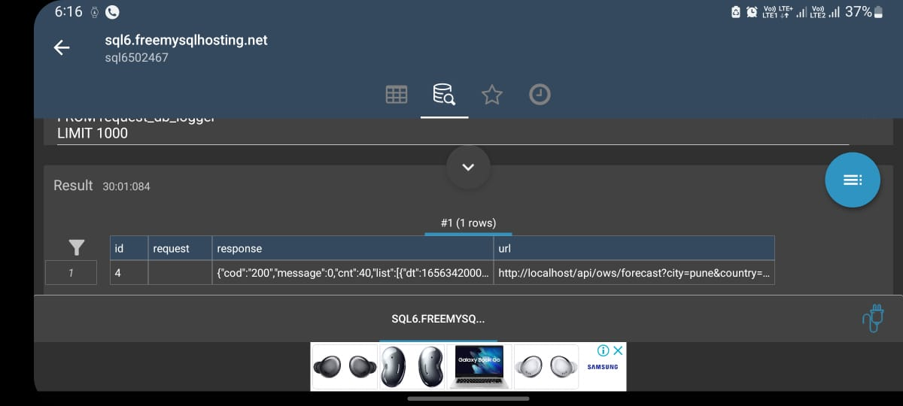

# OpenWeatherForecastBackend
Get 5 Days Weather Forecast from OpenWeatherApi

# To Start this App
Open command prompt add below commands

    mvn clean
    mvn install package

    then,

    ./mvnw spring-boot:run 

    or directly run generated jar file
    
    cd target
    java -jar <jar file name>


### Note : as Used free Db it may cause problem due to connection issue

you can set local db credentials in application.properties file

    spring.datasource.url=jdbc:mysql://localhost:{port}/{DBNAME}
    spring.datasource.username={USERNAME}
    spring.datasource.password={PASSWORD}

Here the screenshot of stored request and response data



# API details
    https://narkhedesam-openweatherforecast-7jq75qr42x9w-8080.githubpreview.dev/api/ows/forecast?city=pune&country=india
    
# Response

```
{
  "cod": "200",
  "message": 0,
  "cnt": 40,
  "list": [
    {
      "dt": 1656342000,
      "main": {
        "temp": 296.53,
        "feelsLike": null,
        "tempMin": null,
        "tempMax": null,
        "pressure": 1006,
        "seaLevel": null,
        "grndLevel": null,
        "humidity": 90,
        "tempKf": null
      },
      "weather": [
        {
          "id": 500,
          "main": "Rain",
          "description": "light rain",
          "icon": "10n"
        }
      ],
      "clouds": {
        "all": 98
      },
      "wind": {
        "speed": 3.51,
        "deg": 253,
        "gust": 10.79
      },
      "visibility": 1464,
      "pop": 0.83,
      "rain": {
        "3h": 0.68
      },
      "sys": {
        "pod": "n"
      },
      "dtTxt": null
    },
    {
      "dt": 1656352800,
      "main": {
        "temp": 296.39,
        "feelsLike": null,
        "tempMin": null,
        "tempMax": null,
        "pressure": 1006,
        "seaLevel": null,
        "grndLevel": null,
        "humidity": 91,
        "tempKf": null
      },
      "weather": [
        {
          "id": 500,
          "main": "Rain",
          "description": "light rain",
          "icon": "10n"
        }
      ],
      "clouds": {
        "all": 98
      },
      "wind": {
        "speed": 2.05,
        "deg": 261,
        "gust": 6.6
      },
      "visibility": 10000,
      "pop": 0.85,
      "rain": {
        "3h": 0.63
      },
      "sys": {
        "pod": "n"
      },
      "dtTxt": null
    },
    {
      "dt": 1656363600,
      "main": {
        "temp": 296.08,
        "feelsLike": null,
        "tempMin": null,
        "tempMax": null,
        "pressure": 1005,
        "seaLevel": null,
        "grndLevel": null,
        "humidity": 90,
        "tempKf": null
      },
      "weather": [
        {
          "id": 500,
          "main": "Rain",
          "description": "light rain",
          "icon": "10n"
        }
      ],
      "clouds": {
        "all": 100
      },
      "wind": {
        "speed": 2.61,
        "deg": 229,
        "gust": 6.36
      },
      "visibility": 10000,
      "pop": 0.21,
      "rain": {
        "3h": 0.12
      },
      "sys": {
        "pod": "n"
      },
      "dtTxt": null
    },
    {
      "dt": 1656374400,
      "main": {
        "temp": 296.08,
        "feelsLike": null,
        "tempMin": null,
        "tempMax": null,
        "pressure": 1006,
        "seaLevel": null,
        "grndLevel": null,
        "humidity": 89,
        "tempKf": null
      },
      "weather": [
        {
          "id": 500,
          "main": "Rain",
          "description": "light rain",
          "icon": "10n"
        }
      ],
      "clouds": {
        "all": 100
      },
      "wind": {
        "speed": 1.62,
        "deg": 229,
        "gust": 3.93
      },
      "visibility": 10000,
      "pop": 0.35,
      "rain": {
        "3h": 0.17
      },
      "sys": {
        "pod": "n"
      },
      "dtTxt": null
    },
    {
      "dt": 1656385200,
      "main": {
        "temp": 297.33,
        "feelsLike": null,
        "tempMin": null,
        "tempMax": null,
        "pressure": 1007,
        "seaLevel": null,
        "grndLevel": null,
        "humidity": 82,
        "tempKf": null
      },
      "weather": [
        {
          "id": 804,
          "main": "Clouds",
          "description": "overcast clouds",
          "icon": "04d"
        }
      ],
      "clouds": {
        "all": 100
      },
      "wind": {
        "speed": 2.93,
        "deg": 246,
        "gust": 5.45
      },
      "visibility": 10000,
      "pop": 0.02,
      "rain": null,
      "sys": {
        "pod": "d"
      },
      "dtTxt": null
    },
    {
      "dt": 1656396000,
      "main": {
        "temp": 300.93,
        "feelsLike": null,
        "tempMin": null,
        "tempMax": null,
        "pressure": 1006,
        "seaLevel": null,
        "grndLevel": null,
        "humidity": 66,
        "tempKf": null
      },
      "weather": [
        {
          "id": 804,
          "main": "Clouds",
          "description": "overcast clouds",
          "icon": "04d"
        }
      ],
      "clouds": {
        "all": 100
      },
      "wind": {
        "speed": 5.75,
        "deg": 251,
        "gust": 7.37
      },
      "visibility": 10000,
      "pop": 0.17,
      "rain": null,
      "sys": {
        "pod": "d"
      },
      "dtTxt": null
    },
    {
      "dt": 1656406800,
      "main": {
        "temp": 301.37,
        "feelsLike": null,
        "tempMin": null,
        "tempMax": null,
        "pressure": 1005,
        "seaLevel": null,
        "grndLevel": null,
        "humidity": 64,
        "tempKf": null
      },
      "weather": [
        {
          "id": 500,
          "main": "Rain",
          "description": "light rain",
          "icon": "10d"
        }
      ],
      "clouds": {
        "all": 100
      },
      "wind": {
        "speed": 6.8,
        "deg": 253,
        "gust": 8.05
      },
      "visibility": 10000,
      "pop": 0.69,
      "rain": {
        "3h": 0.19
      },
      "sys": {
        "pod": "d"
      },
      "dtTxt": null
    },
    {
      "dt": 1656417600,
      "main": {
        "temp": 299.77,
        "feelsLike": null,
        "tempMin": null,
        "tempMax": null,
        "pressure": 1005,
        "seaLevel": null,
        "grndLevel": null,
        "humidity": 68,
        "tempKf": null
      },
      "weather": [
        {
          "id": 804,
          "main": "Clouds",
          "description": "overcast clouds",
          "icon": "04d"
        }
      ],
      "clouds": {
        "all": 90
      },
      "wind": {
        "speed": 5.93,
        "deg": 256,
        "gust": 7.66
      },
      "visibility": 10000,
      "pop": 0.65,
      "rain": null,
      "sys": {
        "pod": "d"
      },
      "dtTxt": null
    },
    {
      "dt": 1656428400,
      "main": {
        "temp": 297.31,
        "feelsLike": null,
        "tempMin": null,
        "tempMax": null,
        "pressure": 1006,
        "seaLevel": null,
        "grndLevel": null,
        "humidity": 77,
        "tempKf": null
      },
      "weather": [
        {
          "id": 803,
          "main": "Clouds",
          "description": "broken clouds",
          "icon": "04n"
        }
      ],
      "clouds": {
        "all": 80
      },
      "wind": {
        "speed": 4.58,
        "deg": 253,
        "gust": 8.91
      },
      "visibility": 10000,
      "pop": 0.01,
      "rain": null,
      "sys": {
        "pod": "n"
      },
      "dtTxt": null
    },
    {
      "dt": 1656439200,
      "main": {
        "temp": 296.64,
        "feelsLike": null,
        "tempMin": null,
        "tempMax": null,
        "pressure": 1007,
        "seaLevel": null,
        "grndLevel": null,
        "humidity": 79,
        "tempKf": null
      },
      "weather": [
        {
          "id": 804,
          "main": "Clouds",
          "description": "overcast clouds",
          "icon": "04n"
        }
      ],
      "clouds": {
        "all": 88
      },
      "wind": {
        "speed": 3.03,
        "deg": 260,
        "gust": 6.72
      },
      "visibility": 10000,
      "pop": 0,
      "rain": null,
      "sys": {
        "pod": "n"
      },
      "dtTxt": null
    },
    {
      "dt": 1656450000,
      "main": {
        "temp": 296.28,
        "feelsLike": null,
        "tempMin": null,
        "tempMax": null,
        "pressure": 1005,
        "seaLevel": null,
        "grndLevel": null,
        "humidity": 83,
        "tempKf": null
      },
      "weather": [
        {
          "id": 804,
          "main": "Clouds",
          "description": "overcast clouds",
          "icon": "04n"
        }
      ],
      "clouds": {
        "all": 100
      },
      "wind": {
        "speed": 2.8,
        "deg": 251,
        "gust": 5.71
      },
      "visibility": 10000,
      "pop": 0,
      "rain": null,
      "sys": {
        "pod": "n"
      },
      "dtTxt": null
    },
    {
      "dt": 1656460800,
      "main": {
        "temp": 295.87,
        "feelsLike": null,
        "tempMin": null,
        "tempMax": null,
        "pressure": 1005,
        "seaLevel": null,
        "grndLevel": null,
        "humidity": 86,
        "tempKf": null
      },
      "weather": [
        {
          "id": 804,
          "main": "Clouds",
          "description": "overcast clouds",
          "icon": "04n"
        }
      ],
      "clouds": {
        "all": 100
      },
      "wind": {
        "speed": 2.6,
        "deg": 253,
        "gust": 4.98
      },
      "visibility": 10000,
      "pop": 0,
      "rain": null,
      "sys": {
        "pod": "n"
      },
      "dtTxt": null
    },
    {
      "dt": 1656471600,
      "main": {
        "temp": 297.44,
        "feelsLike": null,
        "tempMin": null,
        "tempMax": null,
        "pressure": 1006,
        "seaLevel": null,
        "grndLevel": null,
        "humidity": 77,
        "tempKf": null
      },
      "weather": [
        {
          "id": 804,
          "main": "Clouds",
          "description": "overcast clouds",
          "icon": "04d"
        }
      ],
      "clouds": {
        "all": 100
      },
      "wind": {
        "speed": 3.46,
        "deg": 248,
        "gust": 6.35
      },
      "visibility": 10000,
      "pop": 0,
      "rain": null,
      "sys": {
        "pod": "d"
      },
      "dtTxt": null
    },
    {
      "dt": 1656482400,
      "main": {
        "temp": 301.14,
        "feelsLike": null,
        "tempMin": null,
        "tempMax": null,
        "pressure": 1006,
        "seaLevel": null,
        "grndLevel": null,
        "humidity": 60,
        "tempKf": null
      },
      "weather": [
        {
          "id": 804,
          "main": "Clouds",
          "description": "overcast clouds",
          "icon": "04d"
        }
      ],
      "clouds": {
        "all": 100
      },
      "wind": {
        "speed": 5.48,
        "deg": 253,
        "gust": 7.03
      },
      "visibility": 10000,
      "pop": 0,
      "rain": null,
      "sys": {
        "pod": "d"
      },
      "dtTxt": null
    },
    {
      "dt": 1656493200,
      "main": {
        "temp": 302.44,
        "feelsLike": null,
        "tempMin": null,
        "tempMax": null,
        "pressure": 1004,
        "seaLevel": null,
        "grndLevel": null,
        "humidity": 58,
        "tempKf": null
      },
      "weather": [
        {
          "id": 804,
          "main": "Clouds",
          "description": "overcast clouds",
          "icon": "04d"
        }
      ],
      "clouds": {
        "all": 100
      },
      "wind": {
        "speed": 7.15,
        "deg": 257,
        "gust": 8.09
      },
      "visibility": 10000,
      "pop": 0.33,
      "rain": null,
      "sys": {
        "pod": "d"
      },
      "dtTxt": null
    },
    {
      "dt": 1656504000,
      "main": {
        "temp": 300.33,
        "feelsLike": null,
        "tempMin": null,
        "tempMax": null,
        "pressure": 1004,
        "seaLevel": null,
        "grndLevel": null,
        "humidity": 65,
        "tempKf": null
      },
      "weather": [
        {
          "id": 804,
          "main": "Clouds",
          "description": "overcast clouds",
          "icon": "04d"
        }
      ],
      "clouds": {
        "all": 100
      },
      "wind": {
        "speed": 6.81,
        "deg": 253,
        "gust": 8.22
      },
      "visibility": 10000,
      "pop": 0.37,
      "rain": null,
      "sys": {
        "pod": "d"
      },
      "dtTxt": null
    },
    {
      "dt": 1656514800,
      "main": {
        "temp": 297.75,
        "feelsLike": null,
        "tempMin": null,
        "tempMax": null,
        "pressure": 1005,
        "seaLevel": null,
        "grndLevel": null,
        "humidity": 77,
        "tempKf": null
      },
      "weather": [
        {
          "id": 804,
          "main": "Clouds",
          "description": "overcast clouds",
          "icon": "04n"
        }
      ],
      "clouds": {
        "all": 100
      },
      "wind": {
        "speed": 4.3,
        "deg": 238,
        "gust": 8.66
      },
      "visibility": 10000,
      "pop": 0.19,
      "rain": null,
      "sys": {
        "pod": "n"
      },
      "dtTxt": null
    },
    {
      "dt": 1656525600,
      "main": {
        "temp": 296.93,
        "feelsLike": null,
        "tempMin": null,
        "tempMax": null,
        "pressure": 1006,
        "seaLevel": null,
        "grndLevel": null,
        "humidity": 83,
        "tempKf": null
      },
      "weather": [
        {
          "id": 804,
          "main": "Clouds",
          "description": "overcast clouds",
          "icon": "04n"
        }
      ],
      "clouds": {
        "all": 100
      },
      "wind": {
        "speed": 3.23,
        "deg": 243,
        "gust": 7.58
      },
      "visibility": 10000,
      "pop": 0.19,
      "rain": null,
      "sys": {
        "pod": "n"
      },
      "dtTxt": null
    },
    {
      "dt": 1656536400,
      "main": {
        "temp": 296.72,
        "feelsLike": null,
        "tempMin": null,
        "tempMax": null,
        "pressure": 1004,
        "seaLevel": null,
        "grndLevel": null,
        "humidity": 87,
        "tempKf": null
      },
      "weather": [
        {
          "id": 804,
          "main": "Clouds",
          "description": "overcast clouds",
          "icon": "04n"
        }
      ],
      "clouds": {
        "all": 100
      },
      "wind": {
        "speed": 3.14,
        "deg": 252,
        "gust": 9.1
      },
      "visibility": 10000,
      "pop": 0.27,
      "rain": null,
      "sys": {
        "pod": "n"
      },
      "dtTxt": null
    },
    {
      "dt": 1656547200,
      "main": {
        "temp": 296.81,
        "feelsLike": null,
        "tempMin": null,
        "tempMax": null,
        "pressure": 1004,
        "seaLevel": null,
        "grndLevel": null,
        "humidity": 88,
        "tempKf": null
      },
      "weather": [
        {
          "id": 804,
          "main": "Clouds",
          "description": "overcast clouds",
          "icon": "04n"
        }
      ],
      "clouds": {
        "all": 100
      },
      "wind": {
        "speed": 3.09,
        "deg": 261,
        "gust": 8.72
      },
      "visibility": 10000,
      "pop": 0.35,
      "rain": null,
      "sys": {
        "pod": "n"
      },
      "dtTxt": null
    },
    {
      "dt": 1656558000,
      "main": {
        "temp": 297.73,
        "feelsLike": null,
        "tempMin": null,
        "tempMax": null,
        "pressure": 1005,
        "seaLevel": null,
        "grndLevel": null,
        "humidity": 83,
        "tempKf": null
      },
      "weather": [
        {
          "id": 804,
          "main": "Clouds",
          "description": "overcast clouds",
          "icon": "04d"
        }
      ],
      "clouds": {
        "all": 100
      },
      "wind": {
        "speed": 4.01,
        "deg": 242,
        "gust": 8.1
      },
      "visibility": 10000,
      "pop": 0.35,
      "rain": null,
      "sys": {
        "pod": "d"
      },
      "dtTxt": null
    },
    {
      "dt": 1656568800,
      "main": {
        "temp": 299.67,
        "feelsLike": null,
        "tempMin": null,
        "tempMax": null,
        "pressure": 1005,
        "seaLevel": null,
        "grndLevel": null,
        "humidity": 76,
        "tempKf": null
      },
      "weather": [
        {
          "id": 500,
          "main": "Rain",
          "description": "light rain",
          "icon": "10d"
        }
      ],
      "clouds": {
        "all": 100
      },
      "wind": {
        "speed": 5.05,
        "deg": 248,
        "gust": 8.09
      },
      "visibility": 10000,
      "pop": 0.44,
      "rain": {
        "3h": 0.15
      },
      "sys": {
        "pod": "d"
      },
      "dtTxt": null
    },
    {
      "dt": 1656579600,
      "main": {
        "temp": 300.62,
        "feelsLike": null,
        "tempMin": null,
        "tempMax": null,
        "pressure": 1004,
        "seaLevel": null,
        "grndLevel": null,
        "humidity": 69,
        "tempKf": null
      },
      "weather": [
        {
          "id": 500,
          "main": "Rain",
          "description": "light rain",
          "icon": "10d"
        }
      ],
      "clouds": {
        "all": 100
      },
      "wind": {
        "speed": 6.32,
        "deg": 252,
        "gust": 8.62
      },
      "visibility": 10000,
      "pop": 0.71,
      "rain": {
        "3h": 0.28
      },
      "sys": {
        "pod": "d"
      },
      "dtTxt": null
    },
    {
      "dt": 1656590400,
      "main": {
        "temp": 299.48,
        "feelsLike": null,
        "tempMin": null,
        "tempMax": null,
        "pressure": 1004,
        "seaLevel": null,
        "grndLevel": null,
        "humidity": 73,
        "tempKf": null
      },
      "weather": [
        {
          "id": 500,
          "main": "Rain",
          "description": "light rain",
          "icon": "10d"
        }
      ],
      "clouds": {
        "all": 100
      },
      "wind": {
        "speed": 5.89,
        "deg": 253,
        "gust": 8.7
      },
      "visibility": 10000,
      "pop": 0.71,
      "rain": {
        "3h": 0.32
      },
      "sys": {
        "pod": "d"
      },
      "dtTxt": null
    },
    {
      "dt": 1656601200,
      "main": {
        "temp": 297.69,
        "feelsLike": null,
        "tempMin": null,
        "tempMax": null,
        "pressure": 1005,
        "seaLevel": null,
        "grndLevel": null,
        "humidity": 81,
        "tempKf": null
      },
      "weather": [
        {
          "id": 500,
          "main": "Rain",
          "description": "light rain",
          "icon": "10n"
        }
      ],
      "clouds": {
        "all": 100
      },
      "wind": {
        "speed": 4.52,
        "deg": 257,
        "gust": 9.28
      },
      "visibility": 10000,
      "pop": 0.54,
      "rain": {
        "3h": 0.17
      },
      "sys": {
        "pod": "n"
      },
      "dtTxt": null
    },
    {
      "dt": 1656612000,
      "main": {
        "temp": 296.98,
        "feelsLike": null,
        "tempMin": null,
        "tempMax": null,
        "pressure": 1006,
        "seaLevel": null,
        "grndLevel": null,
        "humidity": 84,
        "tempKf": null
      },
      "weather": [
        {
          "id": 804,
          "main": "Clouds",
          "description": "overcast clouds",
          "icon": "04n"
        }
      ],
      "clouds": {
        "all": 100
      },
      "wind": {
        "speed": 4.06,
        "deg": 251,
        "gust": 9.68
      },
      "visibility": 10000,
      "pop": 0.49,
      "rain": null,
      "sys": {
        "pod": "n"
      },
      "dtTxt": null
    },
    {
      "dt": 1656622800,
      "main": {
        "temp": 296.8,
        "feelsLike": null,
        "tempMin": null,
        "tempMax": null,
        "pressure": 1005,
        "seaLevel": null,
        "grndLevel": null,
        "humidity": 87,
        "tempKf": null
      },
      "weather": [
        {
          "id": 500,
          "main": "Rain",
          "description": "light rain",
          "icon": "10n"
        }
      ],
      "clouds": {
        "all": 100
      },
      "wind": {
        "speed": 3.88,
        "deg": 257,
        "gust": 9.18
      },
      "visibility": 10000,
      "pop": 0.4,
      "rain": {
        "3h": 0.1
      },
      "sys": {
        "pod": "n"
      },
      "dtTxt": null
    },
    {
      "dt": 1656633600,
      "main": {
        "temp": 296.79,
        "feelsLike": null,
        "tempMin": null,
        "tempMax": null,
        "pressure": 1005,
        "seaLevel": null,
        "grndLevel": null,
        "humidity": 85,
        "tempKf": null
      },
      "weather": [
        {
          "id": 804,
          "main": "Clouds",
          "description": "overcast clouds",
          "icon": "04n"
        }
      ],
      "clouds": {
        "all": 100
      },
      "wind": {
        "speed": 3.48,
        "deg": 255,
        "gust": 9.22
      },
      "visibility": 10000,
      "pop": 0.4,
      "rain": null,
      "sys": {
        "pod": "n"
      },
      "dtTxt": null
    },
    {
      "dt": 1656644400,
      "main": {
        "temp": 297.51,
        "feelsLike": null,
        "tempMin": null,
        "tempMax": null,
        "pressure": 1006,
        "seaLevel": null,
        "grndLevel": null,
        "humidity": 80,
        "tempKf": null
      },
      "weather": [
        {
          "id": 804,
          "main": "Clouds",
          "description": "overcast clouds",
          "icon": "04d"
        }
      ],
      "clouds": {
        "all": 100
      },
      "wind": {
        "speed": 3.98,
        "deg": 254,
        "gust": 8.72
      },
      "visibility": 10000,
      "pop": 0.36,
      "rain": null,
      "sys": {
        "pod": "d"
      },
      "dtTxt": null
    },
    {
      "dt": 1656655200,
      "main": {
        "temp": 299.02,
        "feelsLike": null,
        "tempMin": null,
        "tempMax": null,
        "pressure": 1007,
        "seaLevel": null,
        "grndLevel": null,
        "humidity": 75,
        "tempKf": null
      },
      "weather": [
        {
          "id": 500,
          "main": "Rain",
          "description": "light rain",
          "icon": "10d"
        }
      ],
      "clouds": {
        "all": 100
      },
      "wind": {
        "speed": 5.45,
        "deg": 249,
        "gust": 9.1
      },
      "visibility": 10000,
      "pop": 0.36,
      "rain": {
        "3h": 0.28
      },
      "sys": {
        "pod": "d"
      },
      "dtTxt": null
    },
    {
      "dt": 1656666000,
      "main": {
        "temp": 299.19,
        "feelsLike": null,
        "tempMin": null,
        "tempMax": null,
        "pressure": 1005,
        "seaLevel": null,
        "grndLevel": null,
        "humidity": 74,
        "tempKf": null
      },
      "weather": [
        {
          "id": 500,
          "main": "Rain",
          "description": "light rain",
          "icon": "10d"
        }
      ],
      "clouds": {
        "all": 99
      },
      "wind": {
        "speed": 5.78,
        "deg": 252,
        "gust": 9.23
      },
      "visibility": 10000,
      "pop": 0.69,
      "rain": {
        "3h": 0.42
      },
      "sys": {
        "pod": "d"
      },
      "dtTxt": null
    },
    {
      "dt": 1656676800,
      "main": {
        "temp": 297.64,
        "feelsLike": null,
        "tempMin": null,
        "tempMax": null,
        "pressure": 1005,
        "seaLevel": null,
        "grndLevel": null,
        "humidity": 84,
        "tempKf": null
      },
      "weather": [
        {
          "id": 500,
          "main": "Rain",
          "description": "light rain",
          "icon": "10d"
        }
      ],
      "clouds": {
        "all": 100
      },
      "wind": {
        "speed": 4.55,
        "deg": 259,
        "gust": 9.46
      },
      "visibility": 10000,
      "pop": 0.69,
      "rain": {
        "3h": 0.19
      },
      "sys": {
        "pod": "d"
      },
      "dtTxt": null
    },
    {
      "dt": 1656687600,
      "main": {
        "temp": 297.09,
        "feelsLike": null,
        "tempMin": null,
        "tempMax": null,
        "pressure": 1007,
        "seaLevel": null,
        "grndLevel": null,
        "humidity": 84,
        "tempKf": null
      },
      "weather": [
        {
          "id": 500,
          "main": "Rain",
          "description": "light rain",
          "icon": "10n"
        }
      ],
      "clouds": {
        "all": 100
      },
      "wind": {
        "speed": 4.23,
        "deg": 256,
        "gust": 9.42
      },
      "visibility": 10000,
      "pop": 0.4,
      "rain": {
        "3h": 0.1
      },
      "sys": {
        "pod": "n"
      },
      "dtTxt": null
    },
    {
      "dt": 1656698400,
      "main": {
        "temp": 296.65,
        "feelsLike": null,
        "tempMin": null,
        "tempMax": null,
        "pressure": 1007,
        "seaLevel": null,
        "grndLevel": null,
        "humidity": 84,
        "tempKf": null
      },
      "weather": [
        {
          "id": 804,
          "main": "Clouds",
          "description": "overcast clouds",
          "icon": "04n"
        }
      ],
      "clouds": {
        "all": 99
      },
      "wind": {
        "speed": 3.45,
        "deg": 249,
        "gust": 9.35
      },
      "visibility": 10000,
      "pop": 0.4,
      "rain": null,
      "sys": {
        "pod": "n"
      },
      "dtTxt": null
    },
    {
      "dt": 1656709200,
      "main": {
        "temp": 296.28,
        "feelsLike": null,
        "tempMin": null,
        "tempMax": null,
        "pressure": 1006,
        "seaLevel": null,
        "grndLevel": null,
        "humidity": 88,
        "tempKf": null
      },
      "weather": [
        {
          "id": 804,
          "main": "Clouds",
          "description": "overcast clouds",
          "icon": "04n"
        }
      ],
      "clouds": {
        "all": 100
      },
      "wind": {
        "speed": 3.33,
        "deg": 248,
        "gust": 8.68
      },
      "visibility": 10000,
      "pop": 0.4,
      "rain": null,
      "sys": {
        "pod": "n"
      },
      "dtTxt": null
    },
    {
      "dt": 1656720000,
      "main": {
        "temp": 295.99,
        "feelsLike": null,
        "tempMin": null,
        "tempMax": null,
        "pressure": 1005,
        "seaLevel": null,
        "grndLevel": null,
        "humidity": 91,
        "tempKf": null
      },
      "weather": [
        {
          "id": 804,
          "main": "Clouds",
          "description": "overcast clouds",
          "icon": "04n"
        }
      ],
      "clouds": {
        "all": 100
      },
      "wind": {
        "speed": 2.95,
        "deg": 250,
        "gust": 8.99
      },
      "visibility": 8225,
      "pop": 0.4,
      "rain": null,
      "sys": {
        "pod": "n"
      },
      "dtTxt": null
    },
    {
      "dt": 1656730800,
      "main": {
        "temp": 296.89,
        "feelsLike": null,
        "tempMin": null,
        "tempMax": null,
        "pressure": 1007,
        "seaLevel": null,
        "grndLevel": null,
        "humidity": 86,
        "tempKf": null
      },
      "weather": [
        {
          "id": 804,
          "main": "Clouds",
          "description": "overcast clouds",
          "icon": "04d"
        }
      ],
      "clouds": {
        "all": 100
      },
      "wind": {
        "speed": 3.26,
        "deg": 256,
        "gust": 7.85
      },
      "visibility": 8439,
      "pop": 0.4,
      "rain": null,
      "sys": {
        "pod": "d"
      },
      "dtTxt": null
    },
    {
      "dt": 1656741600,
      "main": {
        "temp": 297.27,
        "feelsLike": null,
        "tempMin": null,
        "tempMax": null,
        "pressure": 1007,
        "seaLevel": null,
        "grndLevel": null,
        "humidity": 87,
        "tempKf": null
      },
      "weather": [
        {
          "id": 804,
          "main": "Clouds",
          "description": "overcast clouds",
          "icon": "04d"
        }
      ],
      "clouds": {
        "all": 100
      },
      "wind": {
        "speed": 3.26,
        "deg": 247,
        "gust": 7.68
      },
      "visibility": 6400,
      "pop": 0.4,
      "rain": null,
      "sys": {
        "pod": "d"
      },
      "dtTxt": null
    },
    {
      "dt": 1656752400,
      "main": {
        "temp": 299.02,
        "feelsLike": null,
        "tempMin": null,
        "tempMax": null,
        "pressure": 1005,
        "seaLevel": null,
        "grndLevel": null,
        "humidity": 77,
        "tempKf": null
      },
      "weather": [
        {
          "id": 500,
          "main": "Rain",
          "description": "light rain",
          "icon": "10d"
        }
      ],
      "clouds": {
        "all": 100
      },
      "wind": {
        "speed": 4.81,
        "deg": 251,
        "gust": 8.08
      },
      "visibility": 10000,
      "pop": 0.55,
      "rain": {
        "3h": 0.41
      },
      "sys": {
        "pod": "d"
      },
      "dtTxt": null
    },
    {
      "dt": 1656763200,
      "main": {
        "temp": 298.7,
        "feelsLike": null,
        "tempMin": null,
        "tempMax": null,
        "pressure": 1005,
        "seaLevel": null,
        "grndLevel": null,
        "humidity": 76,
        "tempKf": null
      },
      "weather": [
        {
          "id": 500,
          "main": "Rain",
          "description": "light rain",
          "icon": "10d"
        }
      ],
      "clouds": {
        "all": 99
      },
      "wind": {
        "speed": 5.32,
        "deg": 253,
        "gust": 8.69
      },
      "visibility": 10000,
      "pop": 0.59,
      "rain": {
        "3h": 0.37
      },
      "sys": {
        "pod": "d"
      },
      "dtTxt": null
    }
  ],
  "city": {
    "id": 1259229,
    "name": "Pune",
    "coord": {
      "lat": 18.5196,
      "lon": 73.8553
    },
    "country": "IN",
    "population": 9999,
    "timezone": 19800,
    "sunrise": 1656289822,
    "sunset": 1656337473
  }
}
```
